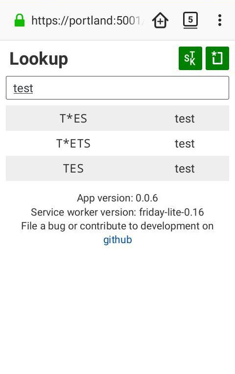

# a small steno lookup app

this is a small and lightweight app i made that lets you look up definitions from your steno dictionary on the go. it uses service workers to provide offline support, and webassembly to make lookups fast while keeping the memory footprint as small as possible. the ui framework is svelte, which is why the ui is so lightweight.

### things that are nice

- small (less than 100kB for the whole app)
- does not need the internet at all after it's been loaded the first time (only if you want to update)
- fast (runs well on my 8-year-old galaxy s2)
- low memory usage, so the tab can stay open in the background (just a few megabytes, about as much as the dictionary in json form)

### things that are not so nice

- the current lookup/dictionary handling code is kind of complex and not that easy to modify. i think part of that is the price to pay for the performance characteristics, but it might be worth trying alternatives and seeing if we can do without it.
- absolutely does not work without a modern browser, since webassembly support is crucial. also because i never want to do css layout with anything other than grid/flexbox ever again.

### screenshots

  


## development setup

you'll need [node](https://nodejs.org) for the main app, and [rust](https://www.rust-lang.org/) for the wasm module. optionally, you can also install wasm-strip from the [webassembly binary toolkit](https://github.com/WebAssembly/wabt) to make the resulting wasm file smaller.

the main app is based on the project template for [svelte](https://svelte.dev) apps from https://github.com/sveltejs/template. i've included the relevant parts from their readme below.

### Get started

Install the dependencies...

```bash
cd svelte-app
npm install
```

...then start [Rollup](https://rollupjs.org):

```bash
npm run dev
```

Navigate to [localhost:5000](http://localhost:5000). You should see your app running. Edit a component file in `src`, save it, and reload the page to see your changes.

By default, the server will only respond to requests from localhost. To allow connections from other computers, edit the `sirv` commands in package.json to include the option `--host 0.0.0.0`.

### testing the release service worker

the normal development build (`npm run dev`) includes a very simple service worker that does basically nothing. if you're working on the service worker that's actually used in production, you'll want to use the `server.py` script. it automatically serves the release service worker instead of the normal one, and it provides automatic hash-based versioning based on the files it finds in the directory. be aware that it has a master list of all files that are included in the app, so you may have to adjust that if you're adding or removing files. resources that are not on this list will not be included. `server.py` listens on port 5001 by default, so you can let it run alongside `npm run dev`. ⚠ *warning:* by default, this server listens on all interfaces, not just local ones. this is so that you can test on your smartphone, but it also means that anyone on the same network as you can talk to the probably insecure testing server. be careful what network you're on before using this!

### making a release

to make a release, use `prepare-release.py <release-directory>`, and give it the directory where you want all the files to go. it will pull the version number from `package.json` and automatically tag the current commit, so it expects the working directory to be clean. it will then run `npm run build` (just to make sure), generate the version info file, and copy all of the files into your release directory. it will also make a special subdirectory for just this version, even though this isn't used right now.

### building the rust code

the rust code lives in the `wasm` directory. it does not rely on `wasm-pack`, since that includes a lot of boilerplate code and requires an allocator, both of which i've tried to avoid in the current version. instead, it just builds directly to the `wasm32-unknown-unknown` target, which is suprisingly simple. however, you may have to install the target manually with `rustup target add wasm32-unknown-unknown`.

once you have done this, switch to the wasm directory and just run `cargo build --release`. once that's done, run the `post-build.sh` script. (if you're on linux – i'm sorry that this doesn't work cross platform currently.) this script does two things:

1. run `wasm-strip` on the binary, to remove the debug sections produced by the rust compiler. (yes, it does this even in release mode. no, i did not figure out how to turn this off.)
2. copies the file from `target/wasm32-unknown-unknown/release/wasm.wasm` into the `public` directory of the web app, renaming it to `helpers.wasm`.

you can do these steps manually if you can't run the script. running `wasm-strip` is optional, too. you really only need to copy the file to the right place.